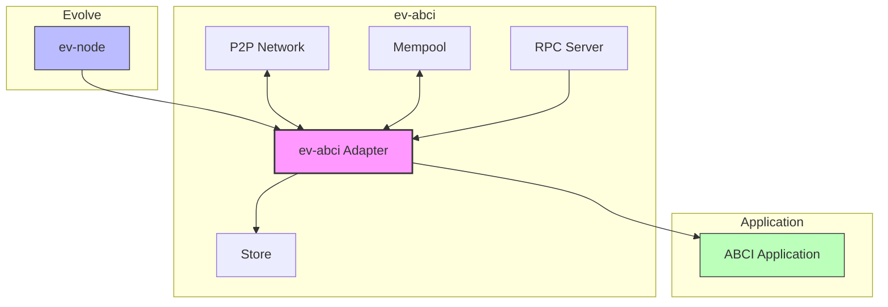
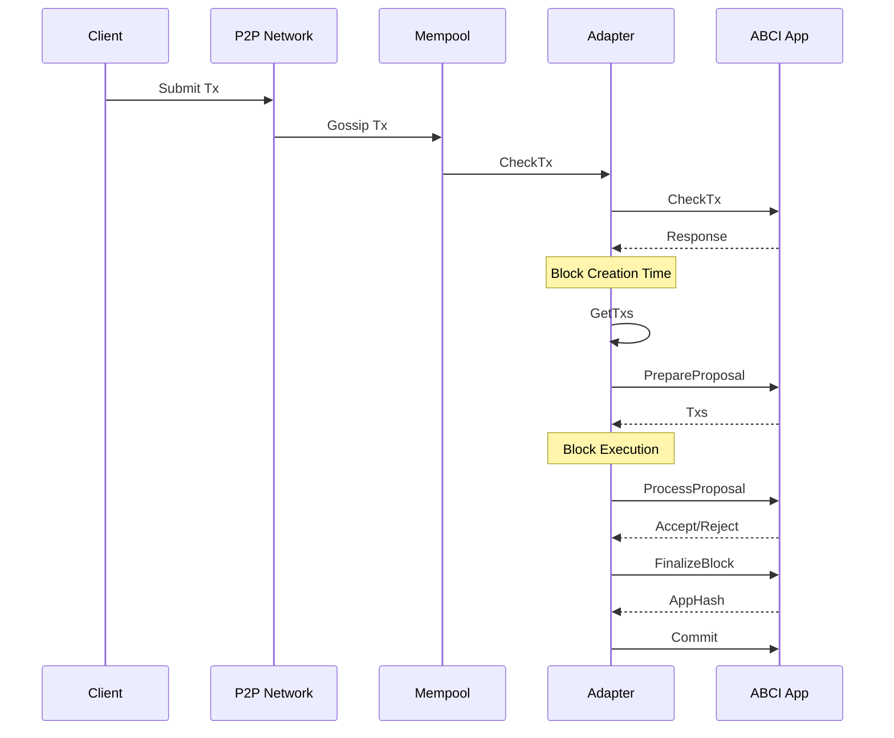
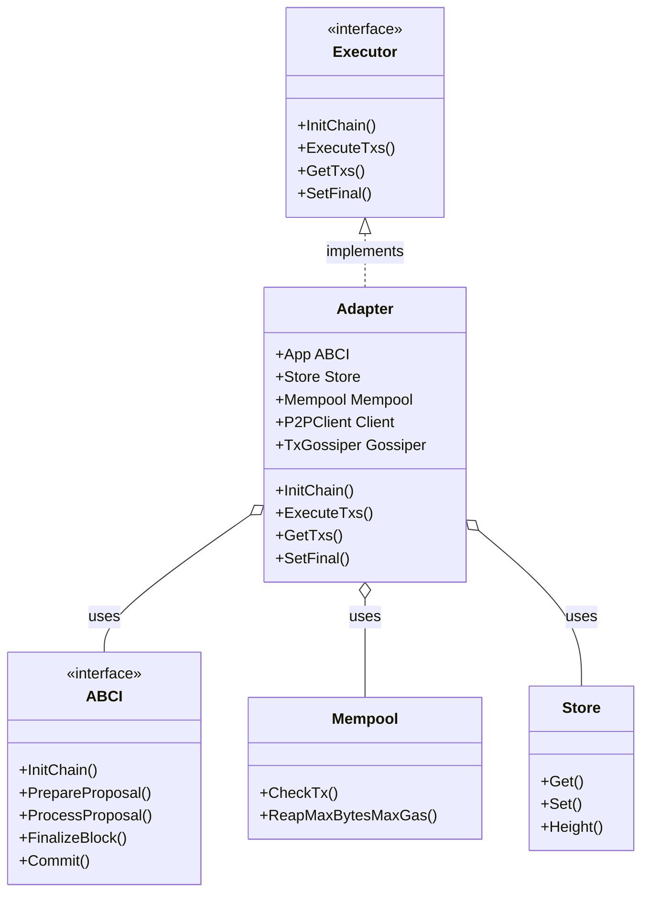

# ev-abci

An ABCI adapter for [Evolve](https://github.com/evstack/ev-node) that enables ABCI-compatible applications to be used with Evolve's execution layer.

## Overview

`ev-abci` is a bridge between ABCI-compatible applications and Evolve's execution layer. It implements the Evolve execution interface and adapts it to the ABCI interface, allowing developers to use existing ABCI applications with Evolve.

This adapter connects various components of the Evolve ecosystem:

- Provides compatibility with the Cosmos SDK and CometBFT ABCI applications
- Implements transaction handling, state management, and blockchain operations
- Supports P2P communication for transaction gossip

## Architecture Overview



## Features

- **ABCI Compatibility**: Run any ABCI-compatible application with Evolve.
- **Transaction Management**: Handles transaction receipt, validation, and execution.
- **State Management**: Manages blockchain state including validators and consensus parameters.
- **P2P Communication**: Implements transaction gossip across the network.
- **RPC Endpoints**: Provides compatible API endpoints for clients to interact with.

## ABCI Compatibility

This adapter achieves compatibility with ABCI by calling the appropriate methods on the ABCI application during the execution lifecycle. It implements the necessary interfaces to ensure that transactions are processed correctly, blocks are finalized, and state is committed.

Note, that because of the nature of ev-node (single proposer), **Vote Extensions are not supported**. The adapter will not call the `VoteExtensions` methods on the ABCI application, and any logic related to vote extensions should be handled separately or not used at all.

## Usage

The adapter can be used to create a Evolve node with an ABCI application, such as a Cosmos SDK chain.
Here Ignite CLI with the [evolve app](https://github.com/ignite/apps/tree/main/evolve) is used for simplicity.

```bash
ignite s chain gm --address-prefix gm --minimal --no-module
cd gm
ignite app install -g github.com/ignite/apps/evolve@latest
ignite evolve add
ignite chain build --skip-proto
ignite evolve init
go tool github.com/evstack/ev-node/tools/local-da &
gmd start --rollkit.node.aggregator
```

## Transaction Flow

The following diagram illustrates how transactions flow through the system:



## Architecture

The adapter consists of several key components:

1. **Adapter**: The core component that implements the Evolve (ev-node) executor interface and delegates calls to the ABCI application. The adapter manages the blockchain state and coordinates between different components.

2. **Mempool**: Handles pending transactions before they're included in blocks. The mempool is responsible for:
   - Validating transactions before acceptance
   - Storing pending transactions
   - Providing transactions for block creation

3. **P2P**: Manages transaction gossip between nodes, using libp2p for:
   - Transaction dissemination
   - Discovery of peers
   - Network communication

4. **RPC**: Provides API endpoints compatible with CometBFT RPC for interacting with the node, including:
   - Transaction submission
   - Query services
   - Block and state information

5. **Store**: Persists blockchain state and data, including:
   - Validator sets
   - Consensus parameters
   - Application state



## Contributing

### Prerequisites

- Go 1.25 or later

### Building

```bash
# Install dependencies
make deps

# Run tests
make test

# Generate protocol buffer code (for modules)
make proto-gen
```

### Project Structure

```bash
ev-abci/
├── pkg
│   ├── adapter/      # Core adapter implementation
│   ├── signer/       # Signers helpers functions
│   ├── store/        # Store management for ev-abci
│   ├── p2p/          # Peer-to-peer networking
│   └── rpc/          # RPC server implementation
├── modules/          # Optional Cosmos SDK modules for Evolve
└── server/           # Server startup and configuration
```

## Dependencies

The project relies on several key dependencies:

- [Evolve Node](https://github.com/evstack/ev-node): For the core rollup functionality
- [Cosmos SDK](https://github.com/cosmos/cosmos-sdk): For the ABCI integration
- [CometBFT](https://github.com/cometbft/cometbft): For consensus-related types and functionality
- [libp2p](https://github.com/libp2p/go-libp2p): For peer-to-peer networking
